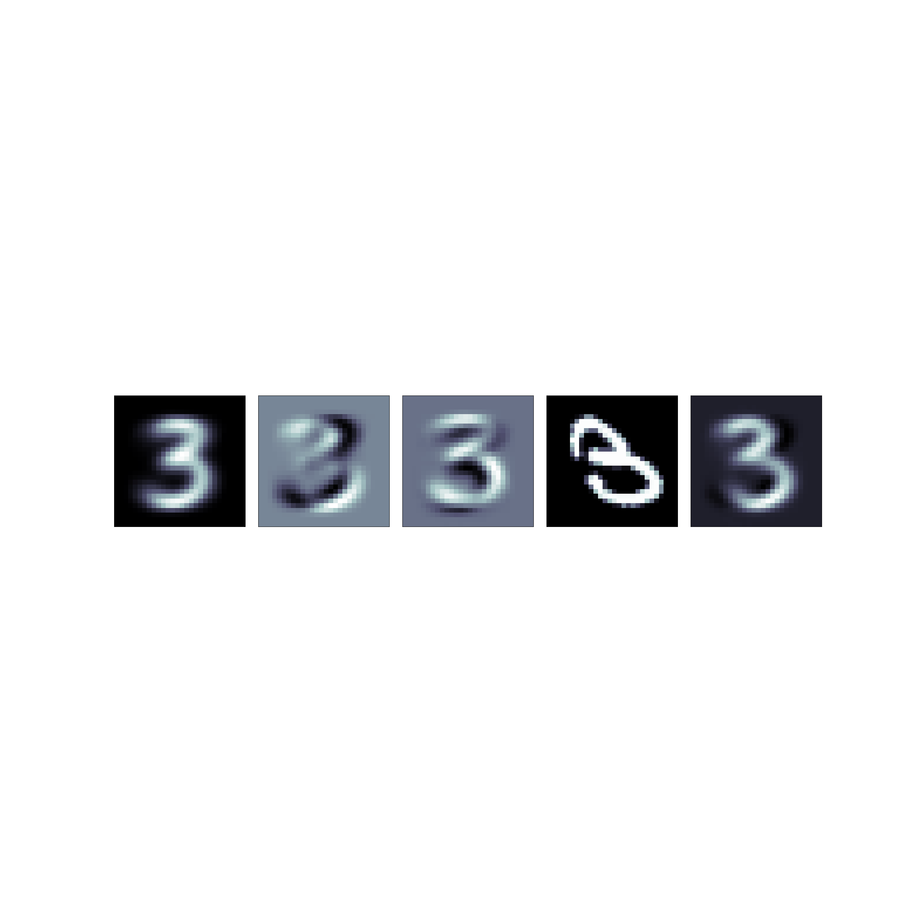
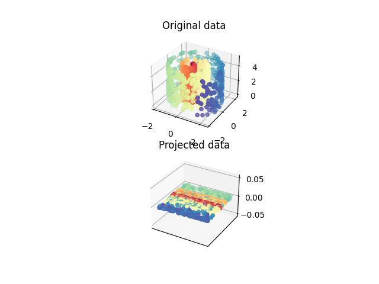
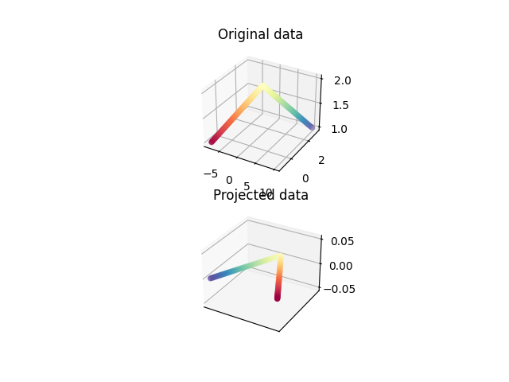
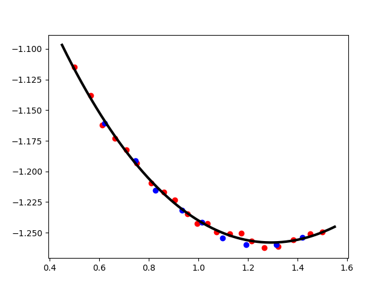
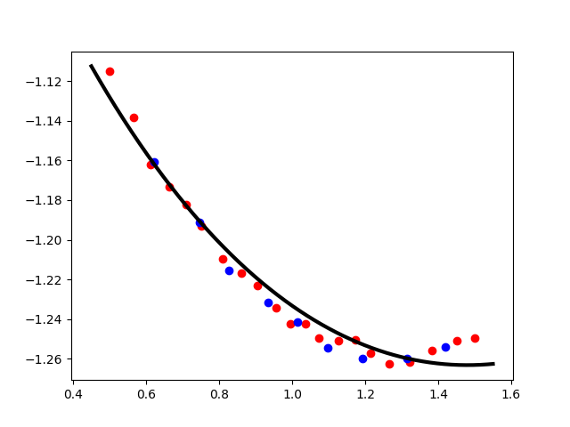
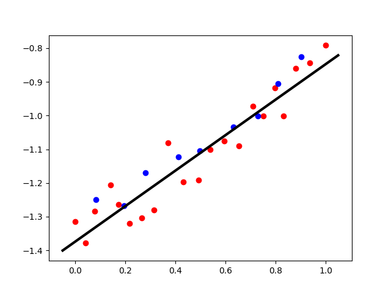
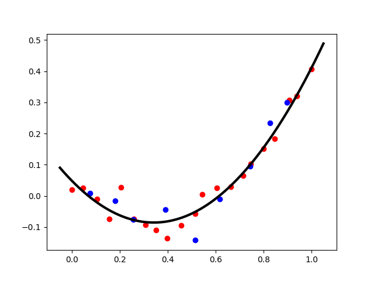

# AI Projects Collection

This repository contains various AI and machine learning projects, homework assignments, and related materials.

## Repository Structure

### Project 01 - Search Algorithms
- **search.py**: Implementation of search algorithms (BFS, DFS, A*, UCS).
- **references.txt**: Reference materials and citations.

### Project 02 - Dimensionality Reduction
Implementation of dimensionality reduction techniques with visualization results.

#### Images:
- **MNIST_2.png**: Dimensionality reduction visualization of MNIST digit dataset.
  

- **Swiss_Roll_2.png**: Dimensionality reduction applied to Swiss Roll dataset.
  

- **toy_data_2.png**: Dimensionality reduction results on toy dataset.
  

#### Code:
- **DR.py**: Main dimensionality reduction implementation.

#### Results:
- Various `.npz` files containing saved model weights and parameters.
- Result directories with numpy arrays for weights (W.npy) and means (mu.npy).

### Project 03 - Probabilistic Inference
Bayesian network implementation and inference.

#### Files:
- **prob_inf.py**: Probabilistic inference implementation.
- **student_bn.csv**: My Bayesian network dataset.
- **student_bn.pdf**: My Bayesian network documentation.
- **student_bn_inference.pdf**: Inference results and analysis.

### Project 04 - Regression Analysis
Linear and non-linear regression implementations with various optimization methods.

#### Images:
- **gauss_newton.png**: Gauss-Newton optimization results visualization.
  

- **gradient_descent.png**: Gradient descent optimization visualization.
  

- **linear_1.png**: Linear regression model results.
  

- **quadratic_2.png**: Quadratic regression model visualization.
  

#### Code:
- **LR.py**: Linear regression implementation.
- **NLR.py**: Non-linear regression implementation.

#### Results:
- Multiple `.npz` result files for different optimization methods.
- Corresponding directories with training/testing data and parameters.

## Getting Started

Each project directory contains its own implementation files. To run any project:

1. Navigate to the specific project directory.
2. Ensure you have the required Python dependencies installed.
3. Run the main Python file for that project.

## Results and Visualizations

The repository includes comprehensive visualization results showing the effectiveness of various AI/ML techniques across different datasets and problem domains.
